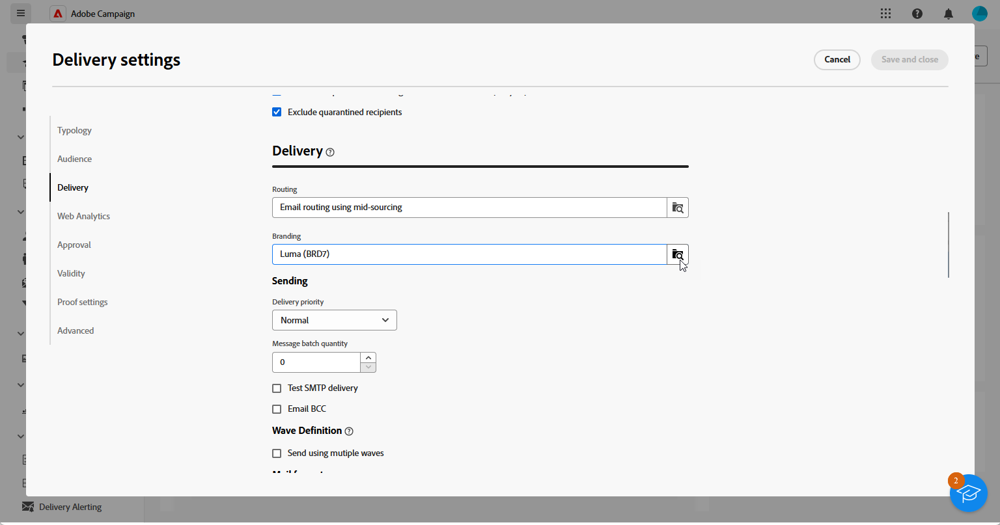

# Uw merk toewijzen {#branding-assign}

>[!IMPORTANT]
>
>De merkopties zijn momenteel beperkt tot e-mail- en pushberichten.

## Een merk koppelen aan een sjabloon {#linking-a-brand-to-a-template}

Om de parameters te gebruiken die voor een merk worden bepaald, moet het met een leveringsmalplaatje worden verbonden. Hiervoor moet u een sjabloon maken of bewerken.

Je template wordt gekoppeld aan het merk. In de e-maileditor maken de elementen zoals **Email address of default sender**, **Default sender name** of **Logo** gebruik van de geconfigureerde merkdata.

>[!BEGINTABS]

>[!TAB  Adobe Campaign V8 ]

Om een leveringsmalplaatje tot stand te brengen, kunt u een ingebouwde malplaatje dupliceren, een bestaande levering in een malplaatje omzetten of een leveringsmalplaatje van kras tot stand brengen. [Meer informatie](https://experienceleague.adobe.com/en/docs/campaign/campaign-v8/send/create-templates)

Nadat u de sjabloon hebt gemaakt, kunt u deze koppelen aan een merk. Dit doet u als volgt:

1. Blader naar **[!UICONTROL Resources]** `>` **[!UICONTROL Templates]** `>` **[!UICONTROL Delivery templates]** in Adobe Campaign Explorer.

1. Selecteer een leveringssjabloon of dupliceer een bestaande sjabloon.

   

1. Open **[!UICONTROL Properties]** van de geselecteerde leveringssjabloon.

   

1. Selecteer op het tabblad **[!UICONTROL General]** uw merk in de vervolgkeuzelijst **[!UICONTROL Branding]** .

   

1. Zodra gevormd, uitgezochte **O.K.**.

U kunt deze sjabloon nu gebruiken om uw leveringen te verzenden.

>[!TAB  het Web van Adobe Campaign ]

Om een leveringsmalplaatje tot stand te brengen, kunt u een ingebouwde malplaatje dupliceren, een bestaande levering in een malplaatje omzetten of een leveringsmalplaatje van kras tot stand brengen. [Meer informatie](https://experienceleague.adobe.com/en/docs/campaign-web/v8/msg/delivery-template)

Nadat u de sjabloon hebt gemaakt, kunt u deze koppelen aan een merk. Dit doet u als volgt:

1. Blader naar het tabblad **[!UICONTROL Templates]** in het linkermenu van **[!UICONTROL Deliveries]** en selecteer een leveringssjabloon.

   

1. Klik op **[!UICONTROL Settings]**.

   

1. Open op het tabblad **[!UICONTROL Delivery]** het veld **[!UICONTROL Branding]** en selecteer het merk dat u aan de sjabloon wilt koppelen.

   

1. Bevestig uw selectie en sla uw sjabloon op.

U kunt deze sjabloon nu gebruiken om uw leveringen te verzenden.

>[!ENDTABS]

## Een merk toewijzen aan uw levering {#assigning-a-brand-to-an-email}

>[!BEGINTABS]

>[!TAB  Adobe Campaign V8 ]

Volg de onderstaande stappen om een nieuwe, zelfstandige levering te maken.

1. Blader naar het tabblad **[!UICONTROL Campaigns]** om een nieuwe levering te maken.

1. Klik op **[!UICONTROL Deliveries]** en klik op de knop **[!UICONTROL Create]** boven de lijst met bestaande leveringen.

   

1. Selecteer een leveringssjabloon.

1. Open **[!UICONTROL Properties]** van de geselecteerde leveringssjabloon.

   

1. Selecteer op het tabblad **[!UICONTROL General]** uw merk in de vervolgkeuzelijst **[!UICONTROL Branding]** .

   

1. Zodra gevormd, uitgezochte **O.K.**.

1. Pas uw leveringen verder aan. Voor meer informatie over het creëren van een e-mail verwijs naar het [ Ontwerp en verzend e-mails ](https://experienceleague.adobe.com/en/docs/campaign-web/v8/msg/email/create-email) sectie.

>[!TAB  het Web van Adobe Campaign ]

Volg de onderstaande stappen om een nieuwe, zelfstandige levering te maken.

1. Blader naar het menu **[!UICONTROL Deliveries]** op de linkertrack en klik op de knop **[!UICONTROL Create delivery]** .

   

1. Selecteer E-mail of Duw bericht als kanaal en kies een leveringsmalplaatje van de lijst.

1. Klik op de knop **[!UICONTROL Create delivery]** ter bevestiging.

1. Klik op **[!UICONTROL Settings]** op de pagina **[!UICONTROL Properties]** .

   

1. Open het veld **[!UICONTROL Branding]** via het tabblad **[!UICONTROL Delivery]** .

   

1. Selecteer het merk dat u aan het malplaatje wilt verbinden.

   

1. Pas uw leveringen verder aan. Voor meer informatie over het creëren van een e-mail verwijs naar [ creeer uw eerste e-mail ](https://experienceleague.adobe.com/en/docs/campaign-web/v8/msg/email/create-email) sectie.

>[!ENDTABS]
