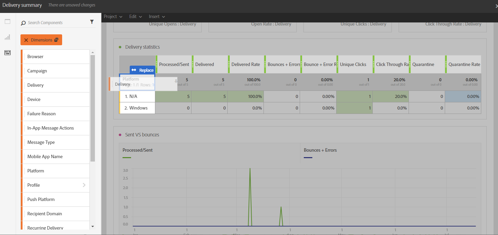

# Componenten toevoegen{#adding-components}

Componenten helpen u bij het aanpassen van rapporten met verschillende afmetingen, meetwaarden en tijdsperioden.

1. Klik op de tab **[!UICONTROL Components]** om de lijst met componenten te openen.

   

1. In elke categorie op het tabblad **[!UICONTROL Components]** worden de vijf meest gebruikte items weergegeven en wordt op de naam van een categorie geklikt voor toegang tot de volledige lijst met componenten.

   De tabel met componenten bestaat uit vier categorieën:

   * **Dimensionen**: Krijg details van het leveringslogboek, zoals browser of domein van de ontvanger, of het succes van een levering.
   * **Metriek**: Krijg details op het statuut van een bericht. Als bijvoorbeeld een bericht is verzonden en de gebruiker het heeft geopend.
   * **[!UICONTROL Segments]**: filtergegevens afhankelijk van het leeftijdsbereik van de ontvanger. **[!UICONTROL Segments]** kan rechtstreeks in een vrije-vormlijst of in de hoogste bar van het paneel worden gesleept en worden gelaten vallen.

     Deze categorie is alleen beschikbaar als de beheerder de voorwaarden van de Dynamic Reporting Usage Agreement heeft goedgekeurd die op het scherm worden weergegeven. Als de beheerder de overeenkomst afwijst, zijn de segmenten niet zichtbaar op het tabblad **[!UICONTROL Components]** en worden er geen gegevens verzameld.

   * **Tijd**: Plaats een tijdspanne voor uw lijst.

1. Sleep componenten in een deelvenster om de gegevens te filteren.

   

1. Nadat u de component hebt gesleept en neergezet, kunt u de tabel verder configureren met de optie **[!UICONTROL Row settings]** .

   

1. U kunt uw lijst verder filtreren door het **pictogram van het Onderzoek** te klikken. Met deze zoekopdracht kunt u naar specifieke resultaten zoeken, zoals een bepaalde levering of browser.

   

U kunt zoveel componenten slepen en neerzetten als u nodig hebt en deze met elkaar vergelijken.

**Verwante onderwerpen:**

* [Lijst met componenten](list-of-components.md)
* [Lijst met rapporten](defining-the-report-period.md)
