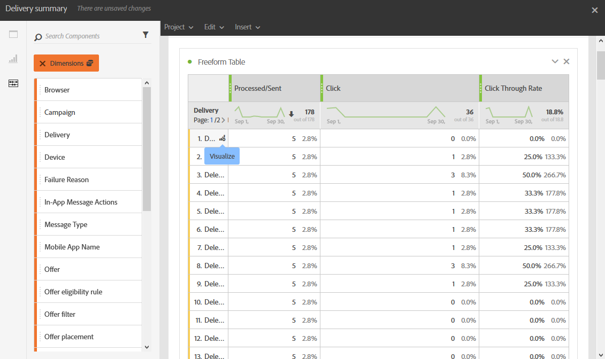

# Deelvensters toevoegen{#adding-panels}

## Een leeg deelvenster toevoegen {#adding-a-blank-panel}

Om uw rapport te beginnen, kunt u een reeks panelen aan een uit doos of douanerapport toevoegen. Elk deelvenster bevat verschillende gegevenssets en bestaat uit vrije-vormtabellen en visualisaties.

In dit deelvenster kunt u uw rapporten naar wens samenstellen. U kunt zoveel deelvensters toevoegen als u wilt in uw rapporten om uw gegevens met verschillende tijdsperiodes te filteren.

1. Klik op de knop **Deelvensters** pictogram. U kunt ook een deelvenster toevoegen door te klikken op de knop **Tabblad Invoegen** en selecteren **Nieuw leeg deelvenster**.

   

1. Sleep de **Leeg deelvenster** in uw dashboard.

   

U kunt nu een vrije-vormlijst aan uw paneel toevoegen beginnen richtend gegevens.

## Een vrije-vormtabel toevoegen {#adding-a-freeform-table}

Met tabellen met vrije vorm kunt u een tabel maken voor het analyseren van uw gegevens met behulp van de verschillende afmetingen en waarden in het dialoogvenster **Component** tabel.

Elke lijst en visualisatie is resizable en kan worden bewogen om uw rapport beter aan te passen.

1. Klik op de knop **[!UICONTROL Panels]** pictogram.

   

1. Sleep de **[!UICONTROL Freeform]** item in het dashboard.

   U kunt ook een tabel toevoegen door op de knop **[!UICONTROL Insert]** tab en selecteren **[!UICONTROL New Freeform]** of door te klikken **[!UICONTROL Add a freeform table]** in een leeg deelvenster.

   

1. In de **[!UICONTROL Drop a segment here]** veld, toevoegen **[!UICONTROL Segment]** van de **[!UICONTROL Components]** in de bovenste balk.

   

1. Items slepen en neerzetten vanuit de **[!UICONTROL Components]** in de kolommen en rijen om uw tabel samen te stellen.

   

1. Klik op de knop **[!UICONTROL Settings]** om te wijzigen hoe de gegevens in uw kolommen worden weergegeven.

   

   De **[!UICONTROL Column settings]** bestaat uit:

   * **[!UICONTROL Number]**: hiermee kunt u samenvattingsnummers weergeven of verbergen in de kolom.
   * **[!UICONTROL Percent]**: hiermee kunt u het percentage in de kolom tonen of verbergen.
   * **[!UICONTROL Interpret zero as no value]**: hiermee kunt u tonen of verbergen wanneer de waarde gelijk is aan nul.
   * **[!UICONTROL Background]**: hiermee kunt u de horizontale voortgangsbalk in cellen weergeven of verbergen.
   * **[!UICONTROL Include retries]**: hiermee kunt u opnieuw proberen in het resultaat opnemen. Dit is alleen beschikbaar voor **[!UICONTROL Sent]** en **[!UICONTROL Bounces + Errors]**.

1. Selecteer een of meerdere rijen en klik op de knop **[!UICONTROL Visualize]** pictogram. Er wordt een visualisatie toegevoegd die de geselecteerde rijen weerspiegelt.

   

U kunt nu zo veel componenten toevoegen als u nodig hebt en ook visualisaties toevoegen om grafische representaties van uw gegevens te geven.
