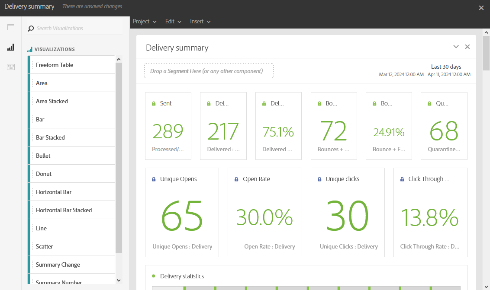

# Visualisaties toevoegen{#adding-visualizations}

Het **Visualisaties** lusje laat u visualiseringspunten, zoals gebied, donut en grafiek slepen en laten vallen. Visualisaties geven u grafische voorstellingen van uw gegevens.

1. Sleep op het tabblad **[!UICONTROL Visualizations]** een visualisatie-item in een deelvenster.

   

1. Nadat het toevoegen van een visualisatie aan uw paneel, ontdekt de Dynamische rapporten automatisch de gegevens in uw vrije vormlijst. Selecteer de instellingen voor uw visualisatie.
1. Als u meer dan één vrije lijst hebt, kies de beschikbare gegevensbron om in uw grafiek in het **venster van de Montages van Source van 0} Gegevens toe te voegen**. Dit venster is ook beschikbaar als u op de gekleurde stip naast de titel voor visualisatie klikt.

   

1. Klik op de knop **[!UICONTROL Visualization]** Instellingen om het grafiektype of de weergave ervan rechtstreeks te wijzigen, zoals:

   * **Percentages**: Toont de waarden in percentage.
   * **de As van het Anker Y bij Nul**: Dwingt de y as aan nul zelfs als de waarden boven nul uitstrekken.
   * **zichtbare Legende**: Laat u de legenda verbergen.
   * **Normalisatie**: Dwingt waarden om aan te passen.
   * **Vertoning Dubbele As**: Voegt een andere as aan uw grafiek toe.
   * **Max. Punten van de Grens**: Beperkt het aantal getoonde grafieken.
   * **Drempel**: Laat u een drempel aan uw grafiek plaatsen. Het wordt weergegeven als een zwarte stippellijn.

   

Dankzij deze visualisatie hebt u een duidelijker beeld van uw gegevens in uw rapporten.
