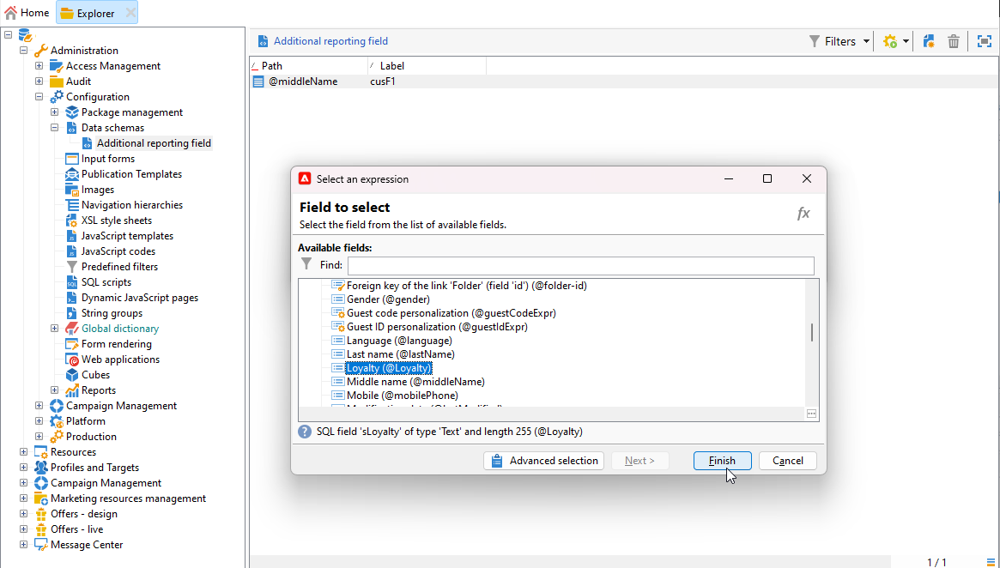

# Een aangepaste profieldimensie maken{#creating-a-custom-profile-dimension}

Rapporten kunnen ook worden gemaakt en beheerd op basis van aangepaste profielgegevens die tijdens de extensie van het ontvangende schema zijn gemaakt.

* [Stap 1: Het ontvangende schema uitbreiden](##extend-schema)
* [Stap 2: Uw nieuwe aangepaste veld koppelen](#link-custom)
* [Stap 3: Creeer een dynamisch rapport aan filterontvangers met de dimensie van het douaneprofiel](#create-report)

## Stap 1: Het ontvangende schema uitbreiden {#extend-schema}

Voer de onderstaande stappen uit om een nieuw profielveld toe te voegen.

1. Ga naar de **[!UICONTROL Administration]** > **[!UICONTROL Configuration]** > **[!UICONTROL Data schemas]** in de Explorer.

   

1. Identificeer uw douane ontvankelijk schema en selecteer het. Als u de ingebouwde nms nog niet hebt uitgebreid:ontvangend schema, verwijs naar [deze procedure](https://experienceleague.adobe.com/en/docs/campaign/campaign-v8/developer/shemas-forms/extend-schema).

1. Voeg uw douanegebied aan de schemaredacteur toe.

   Bijvoorbeeld, om een douane gebied van de Loyalty in uw ontvangend schema toe te voegen:

   ```
   <attribute label="Loyalty" name="loyalty" type="string"/>
   ```

   

1. Klik op **[!UICONTROL Save]**.

1. Vervolgens identificeert u het aangepaste bredeLogRcp-schema en selecteert u dit. Als u nog niet het ingebouwde het logboekschema van de Levering hebt uitgebreid, verwijs naar [deze procedure](https://experienceleague.adobe.com/en/docs/campaign/campaign-v8/developer/shemas-forms/extend-schema).

1. Voeg hetzelfde aangepaste veld als het schema Ontvanger toe aan de schema-editor.

   

1. Klik op **[!UICONTROL Save]**.

1. Als u de wijzigingen wilt toepassen die in de schema&#39;s zijn aangebracht, start u de wizard Database bijwerken via **[!UICONTROL Tools]** > **[!UICONTROL Advanced]** > **[!UICONTROL Update database structure]** en voer de Update de gegevensbestandstructuur uit. [Meer informatie](https://experienceleague.adobe.com/en/docs/campaign/campaign-v8/developer/shemas-forms/update-database-structure)

   

Uw nieuwe profielveld kan nu worden gebruikt en geselecteerd door uw ontvangers.

## Stap 2: Uw nieuwe aangepaste veld koppelen {#link-custom}

>[!NOTE]
>
> U kunt maximaal 20 douanegebied aan Dynamisch rapport toevoegen.

Nu uw profielgebied wordt gecreeerd, moeten wij het met de overeenkomstige Dynamische het melden afmeting verbinden.

1. Ga naar de **[!UICONTROL Administration]** > **[!UICONTROL Configuration]** > **[!UICONTROL Data schemas]** > **[!UICONTROL Additional reporting field]** in de Explorer.

   

1. Klikken **[!UICONTROL New]** om uw overeenkomstige Dynamische het melden afmeting tot stand te brengen.

1. Selecteren **[!UICONTROL Edit expression]** en blader door het Ontvangersschema om uw eerder gecreeerd gebied van het douaneprofiel te vinden.

   

1. Klik op **[!UICONTROL Finish]**.

1. Type-in uw dimensie **[!UICONTROL Label]**, zichtbaar in Dynamische rapportering, en klik **[!UICONTROL Save]**.

   

Het veld Aangepast profiel is nu beschikbaar als een aangepaste profieldimensie in uw rapporten. Als u de aangepaste profieldimensie wilt verwijderen, selecteert u deze en klikt u op de knop **[!UICONTROL Delete]** pictogram.

Nu het ontvankelijke schema met dit profielgebied is uitgebreid en uw douanedimensie gecreeerd, kunt u beginnen ontvangers in leveringen te richten.

## Stap 3: Creeer een dynamisch rapport aan filterontvangers met de dimensie van het douaneprofiel {#create-report}

Nadat u de levering hebt verzonden, kunt u rapporten afbreken met behulp van de dimensie van het aangepaste profiel.

1. Van de **[!UICONTROL Reports]** selecteert u een rapport dat buiten de doos valt of klikt u op de knop **[!UICONTROL Create]** om een geheel nieuwe knop te starten.

   

1. In de **[!UICONTROL Dimensions]** categorie, klikt u op **[!UICONTROL Profile]** dan sleep en laat vallen uw dimensie van het douaneprofiel aan uw vrije vormlijst.

   

1. Sleep alle metriek om te beginnen met het filteren van de gegevens.

1. Sleep indien nodig een visualisatie naar de werkruimte.
