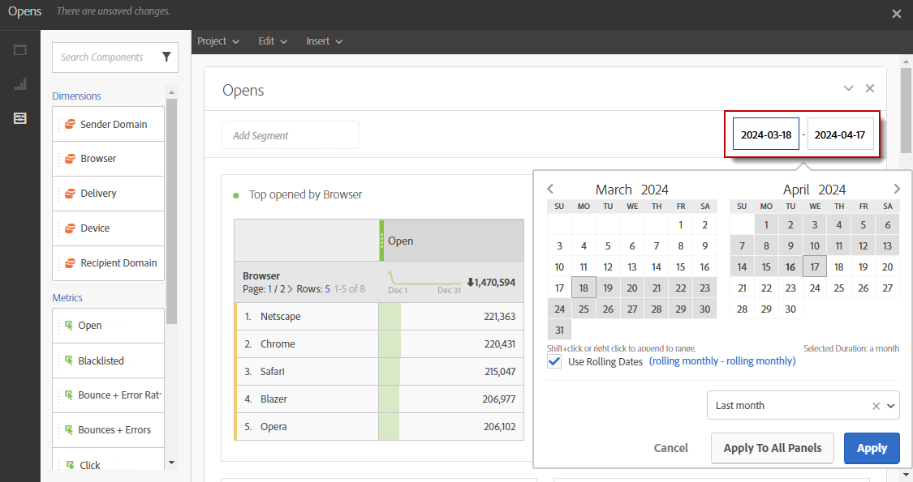

# De rapportperiode definiëren{#defining-the-report-period}

Voordat u een rapport kunt starten of openen, moet u een tijdsperiode toepassen. Rechtsboven in het rapport kan toegang worden verkregen tot de opgegeven periode.

Voor een campagne of programma wordt de filterperiode standaard ingesteld op de begin- en einddatum van het programma of de campagne. Voor een levering komt de begindatum overeen met de verzenddatum en de einddatum met de verzenddatum plus 7 dagen.

Als u het filter wilt wijzigen, selecteert u een begindatum en een periode of gebruikt u de vooraf ingestelde tijdsperiode, zoals vorige week, twee maanden geleden, enz.

Het rapport wordt automatisch bijgewerkt wanneer een filter wordt toegepast of gewijzigd. De geselecteerde rapportperiode zal de gebeurtenissen bepalen die in de periode voorkwamen, niet de volledige reeks gegevens van uw leveringen die in het interval werden gecreeerd, bijvoorbeeld als een levering van 1 tot 5th Januari liep en de rapportperiode 1 tot 2nd Januari is, kunt u gedeeltelijke gegevens zien. Dit kan van invloed zijn op het aantal open/klikpunten, aangezien de open of klik zelfs één maand nadat de levering werd verzonden kan gebeuren.

