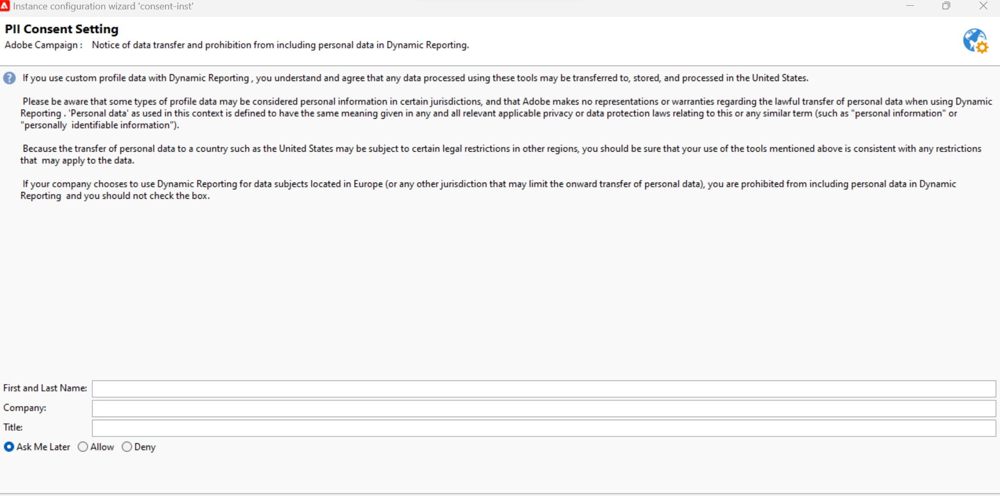

# Dynamische gebruiksovereenkomst voor rapportage {#pii-agreement}

Het doel van de dynamische rapportgebruiksovereenkomst is als pop-uptoestemming voor gegevensverwerking te werken. Standaard is de overeenkomst alleen zichtbaar en kan deze alleen worden geaccepteerd of geweigerd door gebruikers met beheerrechten.

Selecteer **[!UICONTROL Tools]** > **[!UICONTROL Advanced]** > **[!UICONTROL Deployment wizard]** om de gebruiksovereenkomst voor dynamische rapporten te openen.

Er zijn drie opties beschikbaar:

* **[!UICONTROL Ask me later]**: Totdat u de overeenkomst accepteert of afwijst, worden de profielafmetingen niet in uw rapporten weergegeven en worden de persoonlijke identificatiegegevens van uw klanten niet verzameld of verzonden.
* **[!UICONTROL Accept]**: Door deze overeenkomst te accepteren, machtigt u Adobe Campaign om persoonlijke identiteitsgegevens van uw klanten te verzamelen en deze over te dragen aan het rapportage- of datacenter.
* **[!UICONTROL Decline]**: Als u de overeenkomst afwijst, worden de profielafmetingen niet in uw rapporten weergegeven en worden de persoonlijke identificatiegegevens van uw klanten niet verzameld of verzonden. Let erop dat in dit geval externalID nog steeds wordt verzameld en gebruikt om eindgebruikers te identificeren.

In de onderstaande tabel ziet u wat er gebeurt als u deze overeenkomst accepteert, afhankelijk van uw regio.

|  | Dynamische rapportage | Microsoft Dynamics 365-connector |
|---|---|---|
| Amerika en APAC (Azië-Stille Oceaan) | **Beschikbare Eigenschap**.   alle uit-van-de-doos (d.w.z. stad, land/regio, staat, geslacht en segmenten op leeftijdsbasis) &amp; de informatie van douaneprofielen die in het rapporteringscentrum van de V.S. wordt geduwd. | **Beschikbare Eigenschap**.   Alle uit-van-de-doos &amp; de gebieden van douaneprofielen en de gebeurtenisgebieden van Adobe Campaign worden verwerkt in het gegevenscentrum van de V.S. |
| EMEA (Europa, Midden-Oosten en Afrika) | **Beschikbare Eigenschap**.   Alle uit-van-de-doos (d.w.z. stad, land/regio, staat, geslacht en segmenten op leeftijdsbasis) &amp; informatie van douaneprofielen die in het EMEA rapporteringscentrum wordt geduwd. | **Beschikbare Eigenschap.**   Alle uit-van-de-doos &amp; de gebieden van douaneprofielen en de gebeurtenisgebieden van Adobe Campaign die in het EMEA gegevenscentrum worden verwerkt.  **[!UICONTROL Control data]**&#x200B;dat Adobe I/O registratiegegevens en id&#39;s van gebruikersgebeurtenissen voor eindgebruikers van de klant bevat die in het Amerikaanse datacenter worden verzonden en opgeslagen. |

In de onderstaande tabel ziet u wat er gebeurt als deze overeenkomst wordt geweigerd, afhankelijk van uw regio. Zelfs als u deze overeenkomst afwijst, zijn rapportage over leveringen en integratie met Microsoft Dynamics 365 nog steeds beschikbaar.

| Regio | Dynamische rapportage | Microsoft Dynamics 365-connector |
|---|---|---|
| Amerika en APAC (Azië-Stille Oceaan) | **Beschikbare Eigenschap**.   Geen informatie over out-of-the-box en aangepaste profielen verzonden naar het Amerikaanse rapportagecentrum, met uitzondering van ExternalID. | **Beschikbare Eigenschap**.   geen uit-van-de-doos of de gebieden van het douaneprofiel die naar het gegevenscentrum van de V.S. met uitzondering van Externe identiteitskaart en Ontvangersidentiteitskaart worden verzonden   Alle de gebeurtenisgebieden van Adobe Campaign die in het gegevenscentrum van de V.S. met uitzondering van spiegel pagina ID worden verwerkt. |
| EMEA (Europa, Midden-Oosten en Afrika) | **Beschikbare Eigenschap**.   geen uit-van-de-doos &amp; informatie van de douaneprofielen die in het EMEA rapporteringscentrum met uitzondering van ExternalID wordt geduwd. | **Beschikbare Eigenschap.**   Geen uit-van-de-doos of de gebieden van het douaneprofiel die naar het EMEA gegevenscentrum met uitzondering van Externe identiteitskaart en Ontvangersidentiteitskaart worden verzonden   Alle Adobe Campaign gebeurtenisgebieden die in het EMEA gegevenscentrum met uitzondering van spiegelpagina ID worden verwerkt. |

Deze keuze is niet definitief, u kunt deze altijd wijzigen door de optie **[!UICONTROL realtimeReporting_collectPII]** te selecteren in **[!UICONTROL Administration]** > **[!UICONTROL Platform]** > **[!UICONTROL Options]** .

De waarde kan op elk gewenst moment worden gewijzigd. De waarde 1 komt overeen met **[!UICONTROL Ask me later]** , 2 **[!UICONTROL Decline]** en 3 **[!UICONTROL Accept]** .
