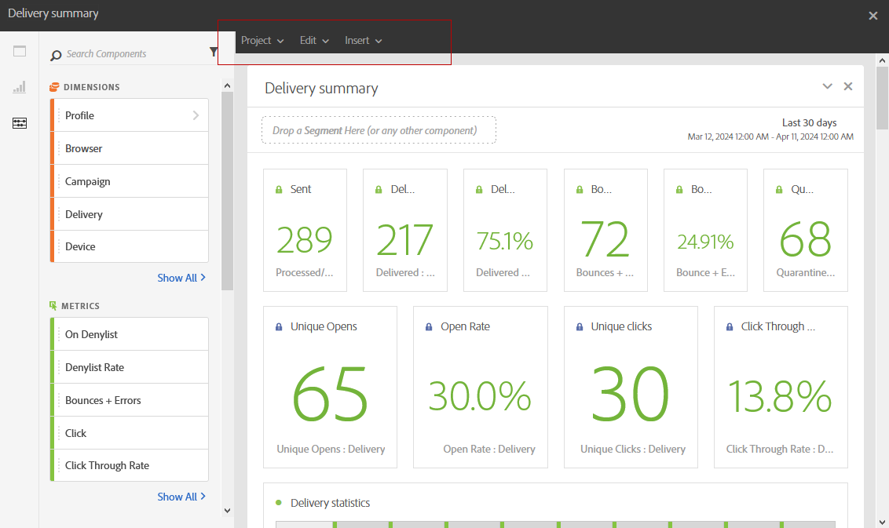

# Rapportage-interface{#reporting-interface}

Op de bovenste werkbalk kunt u bijvoorbeeld uw rapport wijzigen, opslaan of afdrukken.

Gebruik het **lusje van het Project** aan:

* **Open...**: Opent een eerder gecreeerd rapport of een malplaatje.
* **sparen als...**: Dupliceert malplaatjes om hen te kunnen wijzigen.
* **verfrist project**: Werkt uw rapport bij dat op nieuwe gegevens en veranderingen in filters wordt gebaseerd.
* **download CSV**: Exporteert uw rapporten aan een Csv- dossier.

Het **geeft** lusje uit staat u toe:

* **maak** ongedaan: Annuleert uw laatste actie op uw dashboard.
* **ontruim allen**: schrapt elk paneel op uw dashboard.

De **lijst van het Tussenvoegsel** laat u uw rapporten aanpassen door grafieken en lijsten aan uw dashboard toe te voegen:

* **Nieuw Leeg Comité**: Voegt een nieuw leeg paneel aan uw dashboard toe.
* **Nieuwe Vrije vorm**: Voegt een nieuwe vrije vormlijst aan uw dashboard toe.
* **Nieuwe Lijn**: Voegt een nieuwe lijngrafiek aan uw dashboard toe.
* **Nieuwe Bar**: Voegt een nieuwe staafgrafiek aan uw dashboard toe.

**Verwante onderwerpen:**

* [Deelvensters toevoegen](adding-panels.md)
* [Visualisaties toevoegen](adding-visualizations.md)
* [Componenten toevoegen](adding-components.md)

## Tabs {#tabs}

Met de linkertabbladen kunt u uw rapport samenstellen en de gegevens naar wens filteren.

Op deze tabbladen hebt u toegang tot de volgende items:

* **[!UICONTROL Panels]**: voeg een leeg paneel of een vrije vorm aan uw rapport toe beginnen uw gegevens te filtreren. Raadpleeg de sectie Deelvensters toevoegen voor meer informatie hierover
* **[!UICONTROL Visualizations]**: sleep en zet een selectie van visualisatie-items neer om uw rapport een grafische dimensie te geven. Raadpleeg voor meer informatie de sectie Visualisaties toevoegen.
* **[!UICONTROL Components]**: pas uw rapporten aan met verschillende afmetingen, metriek, segmenten en tijdsperioden.

## Werkbalk {#toolbar}

De werkbalk bevindt zich boven de werkruimte. Het wordt samengesteld uit verschillende lusjes, staat u toe, bijvoorbeeld, om uw rapport te wijzigen, te bewaren, te delen of te drukken.

**Verwante onderwerpen:**

* [Deelvensters toevoegen](adding-panels.md)
* [Visualisaties toevoegen](adding-visualizations.md)
* [Componenten toevoegen](adding-components.md)

### Het tabblad Project {#project-tab}

Gebruik het **lusje van het Project** aan:

* **Open...**: Opent een eerder gecreeerd rapport of een malplaatje.
* **sparen als...**: Dupliceert malplaatjes om hen te kunnen wijzigen.
* **verfrist project**: Werkt uw rapport bij dat op nieuwe gegevens en veranderingen in filters wordt gebaseerd.
* **download CSV**: Exporteert uw rapporten aan een Csv- dossier.
* **[!UICONTROL Print]**: druk uw rapport.

### Tabblad Bewerken {#edit-tab}

Het **geeft** lusje uit staat u toe:

* **maak** ongedaan: Annuleert uw laatste actie op uw dashboard.
* **ontruim allen**: schrapt elk paneel op uw dashboard.

### Tabblad Invoegen {#insert-tab}

Het **lusje van het Tussenvoegsel** laat u uw rapporten aanpassen door grafieken en lijsten aan uw dashboard toe te voegen:

* **Nieuw Leeg Comité**: Voegt een nieuw leeg paneel aan uw dashboard toe.
* **Nieuwe Vrije vorm**: Voegt een nieuwe vrije vormlijst aan uw dashboard toe.
* **Nieuwe Lijn**: Voegt een nieuwe lijngrafiek aan uw dashboard toe.
* **Nieuwe Bar**: Voegt een nieuwe staafgrafiek aan uw dashboard toe.
