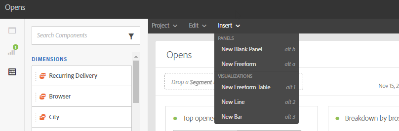

# Rapportage-interface{#reporting-interface}

Op de bovenste werkbalk kunt u bijvoorbeeld uw rapport wijzigen, opslaan of afdrukken.

Gebruik de **Project** tab naar:

* **Openen...**: Opent een eerder gemaakt rapport of een sjabloon.
* **Opslaan als..**: Hiermee dupliceert u sjablonen om deze te kunnen wijzigen.
* **Project vernieuwen**: werkt uw rapport bij op basis van nieuwe gegevens en wijzigingen in filters.
* **CSV downloaden**: Exporteert uw rapporten naar een CSV-bestand.

De **Bewerken** kunt u:

* **Ongedaan maken**: Annuleert de laatste handeling op het dashboard.
* **Alles wissen**: verwijdert elk deelvenster op het dashboard.

De **Invoegen** in de tabel kunt u uw rapporten aanpassen door grafieken en tabellen toe te voegen aan het dashboard:

* **Nieuw leeg deelvenster**: Voegt een nieuw leeg deelvenster toe aan het dashboard.
* **Nieuwe vrije vorm**: Voegt een nieuwe vrije-vormlijst aan uw dashboard toe.
* **Nieuwe regel**: Voegt een nieuwe lijngrafiek aan uw dashboard toe.
* **Nieuwe balk**: Voegt een nieuwe staafgrafiek toe aan het dashboard.

**Verwante onderwerpen:**

* [Deelvensters toevoegen](adding-panels.md)
* [Visualisaties toevoegen](adding-visualizations.md)
* [Componenten toevoegen](adding-components.md)

## Tabs {#tabs}

Met de linkertabbladen kunt u uw rapport samenstellen en de gegevens naar wens filteren.

Op deze tabbladen hebt u toegang tot de volgende items:

* **[!UICONTROL Panels]**: voeg een leeg paneel of een vrije vorm aan uw rapport toe beginnen uw gegevens te filtreren. Raadpleeg de sectie Deelvensters toevoegen voor meer informatie hierover
* **[!UICONTROL Visualizations]**: sleep en zet een selectie van visualisatie-items neer om uw rapport een grafische dimensie te geven. Raadpleeg voor meer informatie de sectie Visualisaties toevoegen.
* **[!UICONTROL Components]**: pas uw rapporten aan met verschillende afmetingen, metriek, segmenten en tijdsperioden.

## Werkbalk {#toolbar}

De werkbalk bevindt zich boven de werkruimte. Het wordt samengesteld uit verschillende lusjes, staat u toe, bijvoorbeeld, om uw rapport te wijzigen, te bewaren, te delen of te drukken.

**Verwante onderwerpen:**

* [Deelvensters toevoegen](adding-panels.md)
* [Visualisaties toevoegen](adding-visualizations.md)
* [Componenten toevoegen](adding-components.md)

### Het tabblad Project {#project-tab}

Gebruik de **Project** tab naar:

* **Openen...**: Opent een eerder gemaakt rapport of een sjabloon.
* **Opslaan als..**: Hiermee dupliceert u sjablonen om deze te kunnen wijzigen.
* **Project vernieuwen**: werkt uw rapport bij op basis van nieuwe gegevens en wijzigingen in filters.
* **CSV downloaden**: Exporteert uw rapporten naar een CSV-bestand.
* **[!UICONTROL Print]**: Druk uw rapport af.

### Tabblad Bewerken {#edit-tab}

De **Bewerken** kunt u:

* **Ongedaan maken**: Annuleert de laatste handeling op het dashboard.
* **Alles wissen**: verwijdert elk deelvenster op het dashboard.

### Tabblad Invoegen {#insert-tab}

De **Invoegen** kunt u uw rapporten aanpassen door grafieken en lijsten aan uw dashboard toe te voegen:

* **Nieuw leeg deelvenster**: Voegt een nieuw leeg deelvenster toe aan het dashboard.
* **Nieuwe vrije vorm**: Voegt een nieuwe vrije-vormlijst aan uw dashboard toe.
* **Nieuwe regel**: Voegt een nieuwe lijngrafiek aan uw dashboard toe.
* **Nieuwe balk**: Voegt een nieuwe staafgrafiek toe aan het dashboard.
