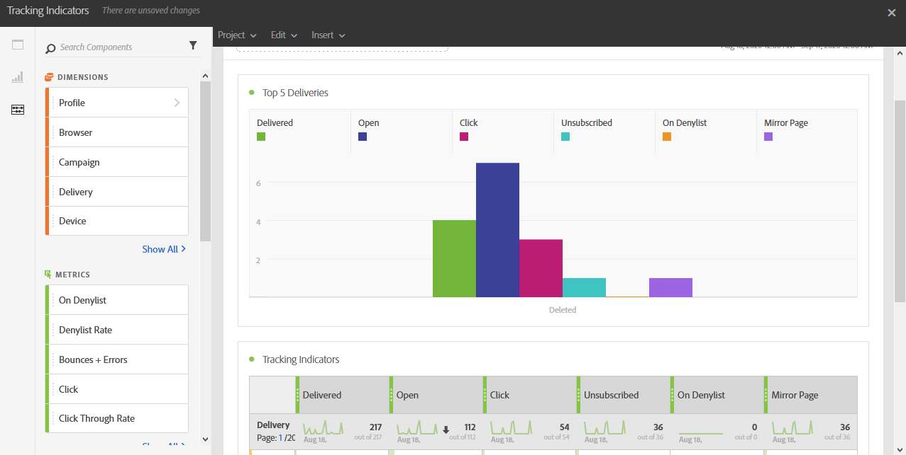

# Trackingsindicatoren{#tracking-indicators}

Het **[!UICONTROL Tracking indicators]** -rapport bevat de belangrijkste indicatoren voor het bijhouden van het gedrag nadat e-mailberichten zijn ontvangen.

>[!NOTE]
>
>Om toegang te krijgen tot deze gegevens, moet het volgen worden toegelaten wanneer het voorbereiden van een levering.

De **[!UICONTROL Tracking indicators]** lijst en **Hoogste 5 leveranties** grafiek bevatten de beschikbare gegevens voor e-mailvolgen, zoals:

* **[!UICONTROL Delivered]**: Het aantal berichten dat is verzonden. Er wordt rekening gehouden met de geconstateerde fouten. er wordt echter geen rekening gehouden met klachten ( spamverklaringen ) en wegberichten zoals &quot; out of office &quot; .
* **Open**: Het aantal tijden een bericht werd geopend in een levering.
* **klik**: Het aantal tijden werd de inhoud geklikt in een levering.
* **Unsubscribed**: Het aantal klikt op de abonnementverbinding.
* **Spam:** het aantal ontvangers die een e-mail als spam hebben verklaard.
* **de Pagina van het Spiegel**: Het aantal klikt op de verbinding van de spiegelpagina.
