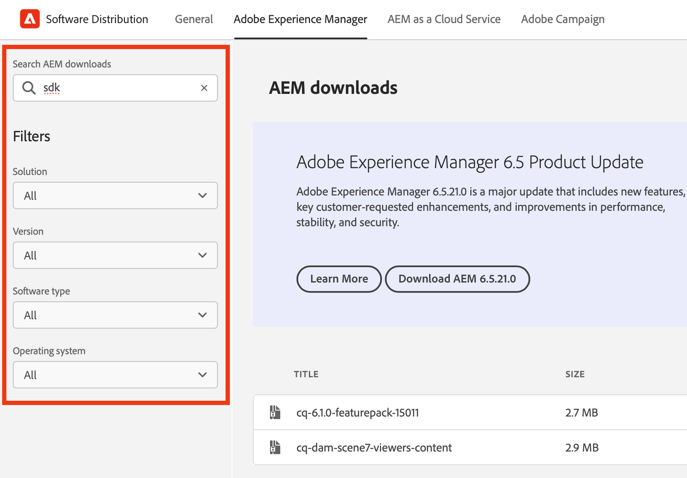

# Softwaredistributie

Leer hoe u softwaredistributie kunt gebruiken om uw Adobe Experience Cloud-software te downloaden.

## Inleiding

Softwaredistributie biedt een efficiënte ervaring om uw Adobe Experience Cloud-software te zoeken en te downloaden. Goedgekeurde softwarepakketten van Adobe en pakketten van partnerbedrijven zijn beschikbaar voor de volgende producten:

1. **Adobe Experience Manager** - alles met betrekking tot dienst en onderhoud, veiligheid, tooling en meer - voor alle gesteunde AEM versies
1. **Adobe Experience Manager als[!UICONTROL Cloud Service]** - [!UICONTROL AEM Cloud SDK], [!UICONTROL AEM Cloud] migratiehulpmiddelen en meer
1. **Adobe Campaign** - Alle huidige [!DNL Campaign] installatieversies en verwante hulpmiddelen
1. **Algemeen** - het Algemene doel tooling met inbegrip van [!DNL Oracle] JDKs voor Adobe klanten

Het gebruik van softwaredistributie is eenvoudig:

1. [Toegang tot softwaredistributie](#accessing)
1. [Uw product selecteren](#selecting)
1. [Uw download zoeken](#finding)
1. [Uw software downloaden](#downloading)

## Toegang tot softwaredistributie {#accessing}

Ga naar [`https://experience.adobe.com/downloads` ](https://experience.adobe.com/downloads) en meld u aan bij [!UICONTROL Software Distribution] met uw Adobe ID om toegang te krijgen tot Softwaredistributie.

## Uw product selecteren {#selecting}

De UI van de Distributie van de Software wordt georganiseerd door product zoals aangetoond in het menu.

 wordt georganiseerd

U komt op het **Algemene** lusje aan, waar u softwaredownloads voor algemeen gebruik kunt vinden.

Tik of klik op het product in het menu waarvoor u de software wilt downloaden. U kunt alleen producten downloaden waarvoor uw organisatie een licentie heeft.

## Uw download zoeken {#finding}

Nadat u het gewenste producttabblad hebt geselecteerd, worden alle verwante downloads weergegeven. Gebruik de zoekfilters in het linkervenster om snel uw download te vinden. Filteropties verschillen per product.

## Uw software downloaden {#downloading}

Als u op een weergegeven download tikt of erop klikt, wordt er een dialoogvenster geopend met meer informatie over de download. U kunt bijvoorbeeld een beschrijving, de naam van de provider en de EULA zien.

U moet EULA goedkeuren door **te selecteren keurt de Termijnen van EULA** goed om de **3} knoop van de Download {toe te laten.**

U kunt een verbinding aan die bepaalde download ook delen door te tikken of **Aandeel** te klikken om URL te kopiëren.

## Pakket delen {#package-share}

In juni 2020 is [!UICONTROL Software Distribution] replace [!UICONTROL Package Share] for AEM and [!DNL Neolane] for [!DNL Campaign]. Dankzij een intuïtieve gebruikersinterface, een vereenvoudigde zoekopdracht en een sterk verbeterde downloadsnelheid is het downloaden van softwarepakketten voor Experience Cloud producten een betere ervaring met softwaredistributie.

>[!IMPORTANT]
>
>Aanmeldingsgegevens van [!UICONTROL Package Share] of [!DNL Neolane] werken niet voor [!UICONTROL Software Distribution] . Dit biedt mogelijkheden om u aan te melden met beveiligingsstandaarden voor de hele Adobe. Neem contact op met een ondersteuningsbeheerder binnen uw organisatie als u uw Adobe ID niet kent.

>[!NOTE]
>
>[!UICONTROL Software Distribution] ondersteunt alleen downloads door browsers. Wanneer u AEM [!UICONTROL Package Manager] gebruikt voor nieuwe installaties, wordt aangeraden het pakket naar een lokale map te downloaden en het pakket van daaruit te installeren.
