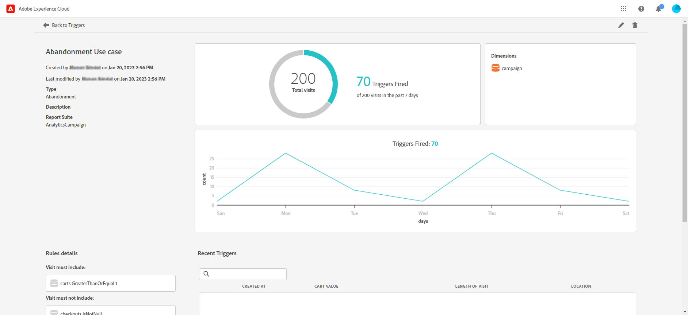

# Een trigger voor een Experience Cloud maken {#create-triggers}

>[!AVAILABILITY]
>
>De nieuwe gebruikersinterface van Adobe Experience Cloud Triggers wordt progressief ingevoerd aan alle klanten. Neem voor meer informatie contact op met uw Adobe.

Maak een trigger en configureer de voorwaarden voor de trigger. U kunt bijvoorbeeld de criteria voor de regels van een trigger tijdens een bezoek opgeven, zoals maateenheden zoals Kart Abandon of afmetingen zoals de productnaam. Wanneer aan de regels wordt voldaan, loopt de trekker.

>[!NOTE]
>
> De nieuwe gebruikersinterface voor Experience Cloud Triggers biedt een intuïtieve ervaring om consumentengedrag te beheren en gebruikerservaring aan te passen. Als u wilt terugschakelen naar de vorige interface, klikt u op de knop **[!UICONTROL Go to classic mode]** .

1. Selecteer in het Experience Cloud eerst het menu van de oplossingsschakelaar en vervolgens **[!UICONTROL Triggers]** .

   

1. Klik op de startpagina op **[!UICONTROL Create Trigger]** en geef vervolgens het type trigger op.

   Er zijn drie typen triggers beschikbaar:

   * **[!UICONTROL Abandonment]**: u kunt een trigger maken die moet worden geactiveerd wanneer een bezoeker een product weergeeft, maar er wordt niets aan het winkelwagentje toegevoegd.

   * **[!UICONTROL Action]**: U kunt bijvoorbeeld triggers maken om na aanmelding voor nieuwsbrieven, e-mailabonnementen of toepassingen voor creditcards (bevestigingen) te activeren. Als u een detailhandelaar bent, kunt u een trekker voor een bezoeker tot stand brengen die zich voor een loyaliteitsprogramma ondertekent. In media en vermaak, creeer trekkers voor bezoekers die op een bepaalde show letten, en misschien wilt u met een onderzoek antwoorden.

   * **[!UICONTROL Session Start and Session End]**: maak een trigger voor het begin en einde van de sessie.

   

1. Voeg een **[!UICONTROL Name]** en een **[!UICONTROL Description]** toe aan de trigger.

1. Selecteer de Analytics **[!UICONTROL Report Suite]** die voor deze trigger wordt gebruikt. Deze instelling identificeert de te gebruiken rapportgegevens.

   [ Leer meer op de Reeks van het Rapport ](https://experienceleague.adobe.com/docs/analytics/admin/admin-tools/manage-report-suites/c-new-report-suite/t-create-a-report-suite.html?lang=nl-NL){target="_blank"} .

1. Kies de geldigheidsperiode **[!UICONTROL Trigger after no action for]** .

1. In de categorieën **[!UICONTROL Visit must include]** en **[!UICONTROL Visit must not include]** kunt u criteria of gedrag van bezoekers definiëren die u wilt of niet wilt gebruiken. U kunt **specificeren en** of **&#x200B;**&#x200B;logica binnen of tussen voorwaarden, afhankelijk van de criteria u bepaalt.

   De regels voor een eenvoudige trigger voor het verlaten van een winkelwagentje kunnen bijvoorbeeld zijn:

   * **[!UICONTROL Visit must include]** : `Carts (metric) Is greater or equal to 1` om bezoekers met ten minste één item in hun winkelwagentje te laten werken.
   * **[!UICONTROL Visit must not include]** : `Checkout (metric) Exists.` om bezoekers te verwijderen die de items in hun winkelwagentjes hebben gekocht.

   

1. Klik op **[!UICONTROL Container]** om regels, voorwaarden of filters vast te stellen en op te slaan die een trigger definiëren. Als u wilt dat gebeurtenissen tegelijkertijd plaatsvinden, plaatst u ze in dezelfde container.

   Elke container verwerkt onafhankelijk op het raakniveau. Dit houdt in dat als twee containers zijn gekoppeld aan de operator **[!UICONTROL And]** , de regels alleen in aanmerking komen als twee treffers aan de vereisten voldoen.

1. Klik in het veld **[!UICONTROL Metadata]** op **[!UICONTROL + Dimension]** om een of meer specifieke afmetingen voor de campagne te kiezen die relevant zijn voor het gedrag van de bezoeker.

   

1. Klik op **[!UICONTROL Save]**.

1. Selecteer de zojuist gemaakte **[!UICONTROL Trigger]** in de lijst voor toegang tot het detailrapport van de trigger.

   

1. Vanuit de gedetailleerde weergave van de trigger hebt u toegang tot de rapporten over het aantal triggers dat is geactiveerd. Indien nodig kunt u de trigger bewerken met het potloodpictogram.

   
